# MissingSemesterOfCS

## Brief Introduction
The "Missing Semester Of CS" course wants to tech us "computing ecosystem literacy" that is how to master tools like the command-line, text-editor, version control system and so on.

Mastering these tools not only enables you to spend less time on figuring out how to bend your tools to your will, but it also lets you solve problems that would previously seem impossibly complex.

- Course homepage: https://missing.csail.mit.edu/
- Lecture video resource link: https://www.bilibili.com/video/BV1x7411H7wa

## Watch!
This doc only covered the essential useful skill&knowledge about the terminal, the git and so on. If you want to get more information about these tools, like how to beautify the terminal fonts and colors and others, please google it :)

## Terminal & Shell Scripts
Terminal,also called shell,is a tool for computer users to type-in commands and control the operating system. For example, we can type ```shutdown now```to shut down my linux computer immediately.


### Type commands on the terminal
In myself conclusion, there are three steps to type commands:
1. Make sure what you want to do with commands? For example, I want to let terminal show the current UTC time.
2. Figure out which command and parameters will satisfy the task. For example, ```date -u``` is the one possible command; and "-u" is the parameter to told the date command:"we need the UTC time"
3. Type commands on the terminal and check the return information.

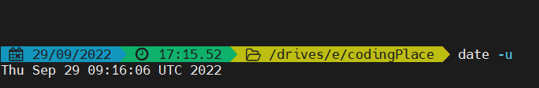
   
### String value in Shell
We can use quotes to contain string value,like:

```shell
echo "Hello world!"
```

### Variable Assignment
Be careful that the variable assignment can't work with blanks between "=".

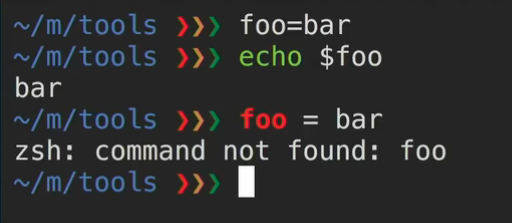

### Use Variables
Shell grammar specified '$' symbol for variable usages:

```shell
echo $PATH
```

### Use Command as variables which contained return values
pwd is a command which return current working directory. "$(pwd)" is a syntax that uses commands as a variable which contains the command return value. 

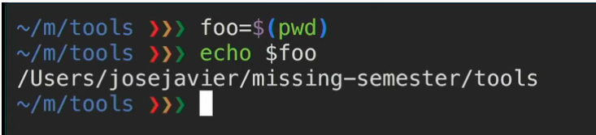

### Variable replacement in double quote string
If you need replace variables in string, please use double
quote string, and don't use single quote string.

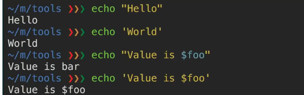

### Define a shell script and call it
The first line in the shell script which started with "#!" told
shell that the script should be run with python program.

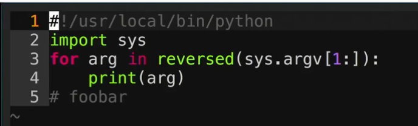

Inside the shell script,we use"$1","$2"..."$n" get the input parameters.

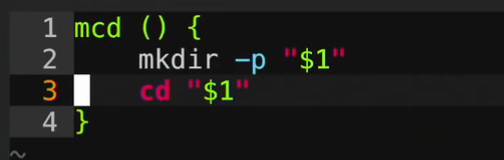

Make a shell command through calling "source xxx.sh"

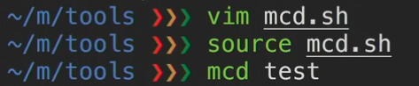


   
### Use "shellcheck" for your scripts checking
For example:

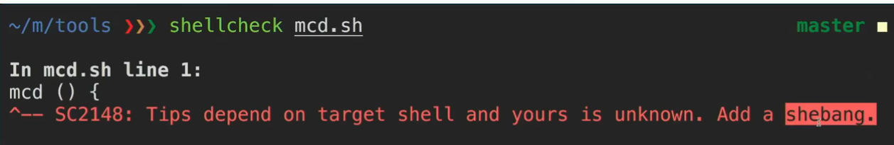


### Feel Free to use 'man' or 'tldr' commands
Working with terminals, it is important that you should feel free to use 'man' commands, which can print help docs.

```shell
# print help doc about ls
man ls 

# print help doc about shutdown
man shutdown

# print simple example doc about shutdown
tldr shutdown
```


### Simple File System Operation
Using 'pwd' to get current path of file system

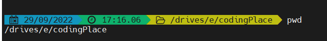

Using 'ls' to list files under current path

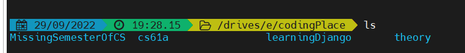

Using 'cd' to change path

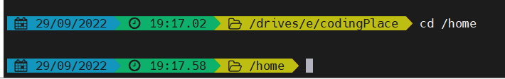

Using 'which' to search binary runnable file

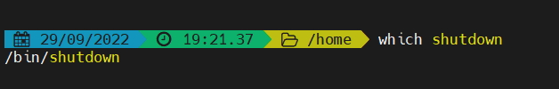

Using 'find' to find file

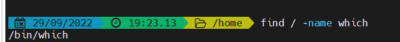

Using 'mv' to move file

```shell
# move current hello.md file to up level and rename to helloworld
mv hello.md ../helloWorld.md
```

Using 'cp' to copy file

```shell
# copy hello.md to hello2.md
cp hello.md hello2.md
```

### File Standard I/O Operators
We can use '<' symbol for input redirection,and use '>' or '>>' symbol for output redirection:

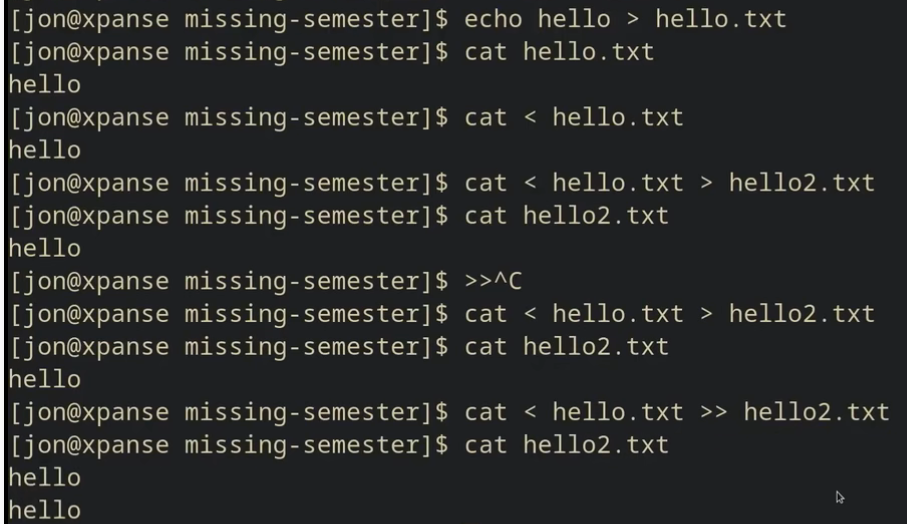

- '<' and '>' use covered writing mode.
- '>>' uses appending writing mode.

Using 'tee' command to check the content which we wrote into file:

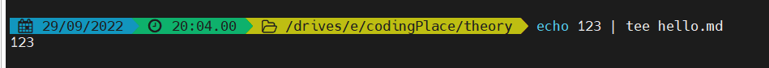

### Error output Operator
Symbol "$?" is a error output operator and the error code 0 is stand for no error, the error code 1 is stand for has errors.

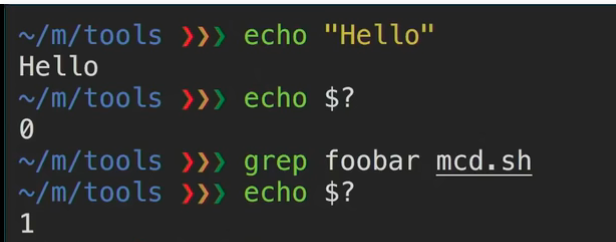

### File System Search Operation
Command "find" is a powerful operation which help you find any type of files, such as special name of file, special type of file, special modification status of file and so on. 


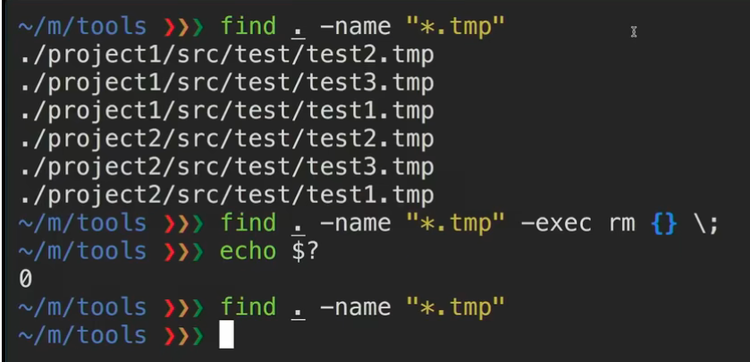

### Network Operation
The "curl" is a network command which can fetch http result from designated url parameters.  

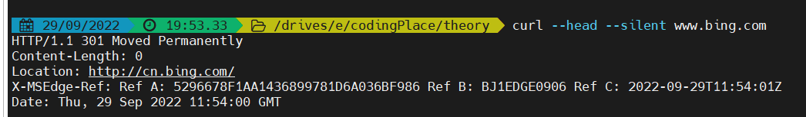

We can use "ping" to check the connection between our computer and opposite website server.  

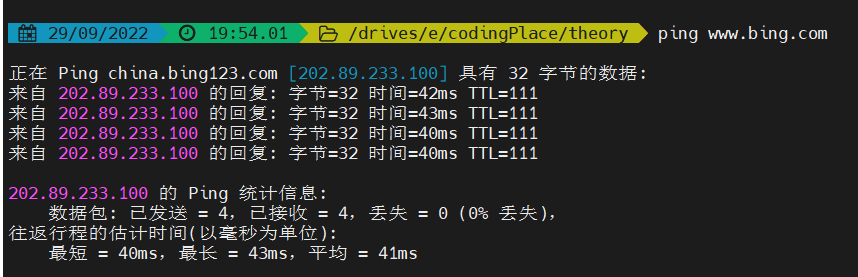
   
### Extra references: Linux Shell Tutorials
- Chinese Version: https://linux.vbird.org/linux_basic/
  - I think this website is the best linux tutorial in Chinese.
- English Version: 

## Version Control Tools

The version control tool can save you from disaster, help you collaborate with others, and quickly find and isolate problematic changes. 

